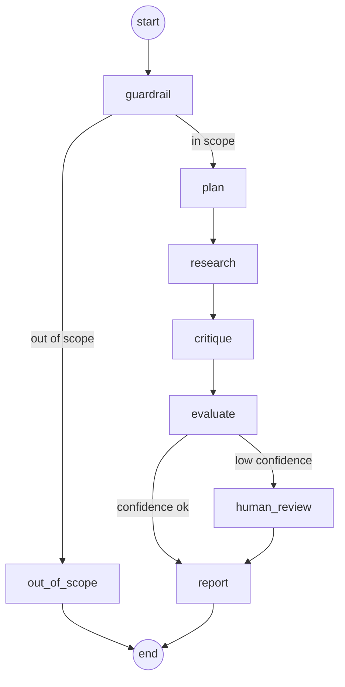

# Architecture

This is a high-level map of the system. For the reasoning and trade-offs behind each decision, see [`docs/adr/`](adr/) — this document describes *what* exists, the ADRs explain *why*.

## Graph flow

- **guardrail** — zero-cost keyword match rejecting a question outside the consumption tax reform domain before any retrieval or LLM call ([ADR-0001](adr/0001-langgraph-orchestration-for-multi-step-tax-research.md), Intent Guardrail amendment).
- **plan** — decomposes the question into independently verifiable sub-questions.
- **research** — retrieves cited excerpts per sub-question; no citation, no answer.
- **critique** — verifies citations support their claims and flags disagreement between sources.
- **evaluate** — aggregates confidence (minimum across sub-answers, not mean — [ADR-0002](adr/0002-evaluator-confidence-aggregation.md)); forces `human_review` below the configured threshold.
- **human_review** — a blocking LangGraph `interrupt()`, persisted by the checkpointer, resumed only by an explicit external decision.
- **report** — produces the final structured response (Pydantic, never free text).

Every node runs inside a single `graph_run` trace span when tracing is configured ([ADR-0005](adr/0005-opentelemetry-instrumentation.md)).

## Components

| Component | Language | Responsibility |
|---|---|---|
| `app/graph/` | Python | The state graph above — LangGraph orchestration, checkpointed to PostgreSQL |
| `app/adapters/` | Python | Concrete implementations of the core ports (Ollama LLM/embeddings, pgvector retrieval, Postgres audit log) |
| `app/core/` | Python | Domain contracts (Pydantic schemas) and ports (Protocols) — no infrastructure dependency |
| `app/evaluation/` | Python | The evaluation harness: a versioned question dataset, a runner, groundedness/keyword grading |
| `app/main.py` | Python | Runtime entry point — ask a question, resume a paused human-review thread |
| `app/evaluate.py` | Python | Runtime entry point — run the evaluation dataset against the real graph |
| `services/ingestion/` | Go | Fetches, hashes, and versions source documents (DOU, Planalto, Receita Federal) into `source_documents`. Runs offline, as a CLI — not called live by the Python graph ([ADR-0001](adr/0001-langgraph-orchestration-for-multi-step-tax-research.md#why-ingestion-is-a-separate-go-service-not-a-python-module)) |

## Data stores

One PostgreSQL instance (with the `pgvector` extension) serves three purposes, deliberately consolidated rather than split across separate stateful services:

1. **LangGraph checkpoints** — state for a paused human-review run, survives a process restart.
2. **Vector search** (`document_chunks`) — embedded chunks of the indexed corpus, queried by cosine similarity.
3. **Audit trail** (`audit_log`) — one row per completed run: query, sub-questions, cited documents, confidence, human decision ([ADR-0004](adr/0004-audit-trail-persistence.md)).

Ollama serves both the chat model (Llama 3.1 8B) and the embedding model (`nomic-embed-text`) locally, at zero API cost ([ADR-0001](adr/0001-langgraph-orchestration-for-multi-step-tax-research.md), LLM Provider and Retrieval Adapter amendments).

Jaeger receives OTLP trace spans from both the Python graph and the Go ingestion CLI — two independent traces, not one propagated across the boundary, since Go is never called live from Python today ([ADR-0005](adr/0005-opentelemetry-instrumentation.md)).

## Full architectural record

| ADR | Decision |
|---|---|
| [0001](adr/0001-langgraph-orchestration-for-multi-step-tax-research.md) | Why LangGraph, the graph structure, output schema, confidence threshold, vector store, Go service split, LLM/embedding provider, intent guardrail |
| [0002](adr/0002-evaluator-confidence-aggregation.md) | Confidence aggregation (minimum, not mean) and disputed-position handling |
| [0003](adr/0003-local-container-packaging.md) | Dockerfiles for the Python and Go services, local-only |
| [0004](adr/0004-audit-trail-persistence.md) | What gets recorded per run, and why it's written from the CLI rather than a graph node |
| [0005](adr/0005-opentelemetry-instrumentation.md) | Span instrumentation, Jaeger export, no Python↔Go trace propagation |
| [0006](adr/0006-ci-scope.md) | What runs in CI (unit + integration against real Postgres) and what doesn't (the real evaluation harness) |
